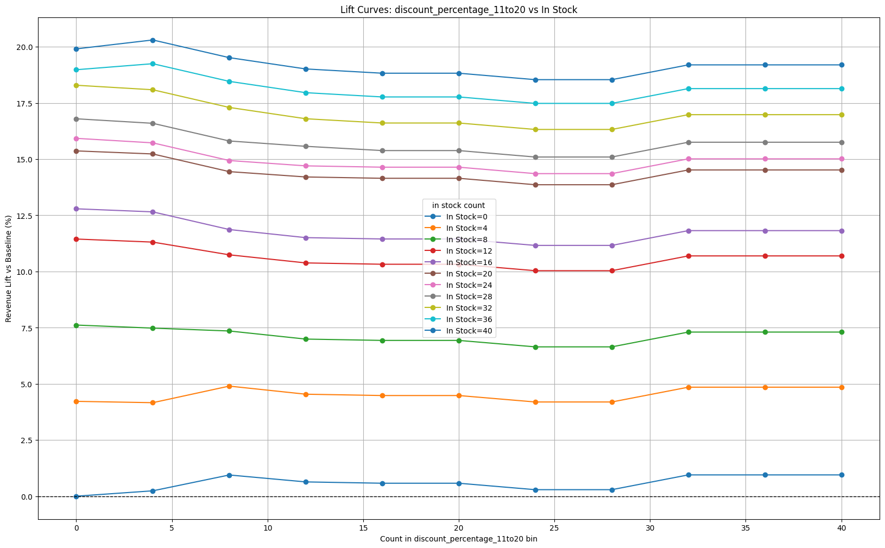
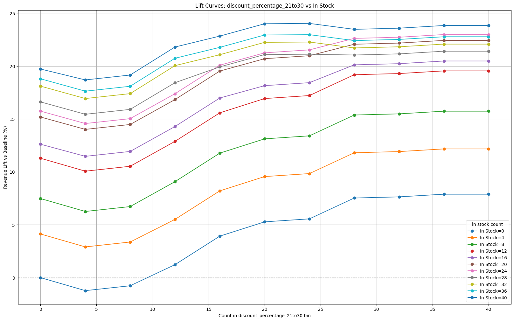
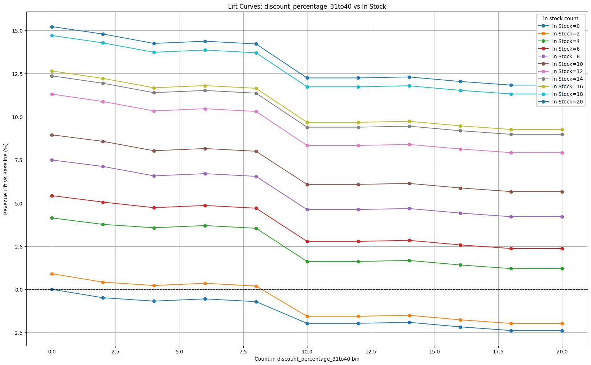

# Pricing Availability Model #

* see src/python_notebooks/econML_pricing_availability.ipynb for work 

### Discount on Revenue ###

| Discount Bin | Avg Effect on Revenue (per discount) | 95% CI (Revenue) | Profit Effect (30% margin) |
|--------------|---------------------------------------|---------------------------|-----------------------------|
| 1–10% | +21.4 | [-1,958 , 2,682] | +6.4 |
| 11–20% | +72.9 | [-1,320 , 2,259] | +21.9 |
| 21–30% | +16.2 | [-1,961 , 1,940] | +4.9 |
| 31–40% | +134.5 | [-12,736 , 21,793] | +40.4 |
| 41–50% | +44.4 | [-13,395 , 22,555] | +13.3 |
| 51–60% | +155.6 | [-26,523 , 20,900] | +46.7 |
| 61–70% | +180.3 | [-101,967 , 47,259] | +54.1 |
| 71–80% | -7.1 | [-237,668 , 56,596] | -2.1 |
| 81–90% | +283.5 | [-84,407 , 111,588] | +85.1 |
| 90–99% | +353.9 | [-151,516 , 440,422] | +106.2 |

### Availability on Revenue ###

|availability| AVG Effect on Revenue (for availbility)| 95% CI (Revenue) |
| --------------------------|------------------------------------|-----------------------------|
|check_cart_for_availability| -26.514 | [-45,004.733, 2,176.461]
|estimated_to_ship_on       | -1.003 | [-3,871.206, 1,110.290]
|available_to_ship_on       | 19.856 | [-325.305, 1,085.819] 
|in_stock                   | 27.782 | [-524.868, 1,504.689]

## Lift vs Discount 11 to 20 %
## Description Lift vs Discount for values of In Stock (color coded)

## Lift vs Discount 21 to 30 %
## Description Lift vs Discount for values of In Stock (color coded)

## Lift vs Discount 31 to 40 %
## Description Lift vs Discount for values of In Stock (color coded)

|----------------------------------------------------------|

# Script Generated, test numbers

| Discount Bin | Allocation Share | Mean Effect (rel) | $ lift/exposure | $ profit/exposure | CI ($) |
|--------------|------------------|-------------------|------------------|-------------------|--------|
| pna_discount_percentage_0 | 1.00 | 9.900 | $93.55 | $28.07 | [-1493.19, 1672.74] |
| pna_discount_percentage_1to10 | 0.00 | 71.020 | $5124.09 | $1281.02 | [-97113.90, 205412.85] |
| pna_discount_percentage_21to30 | 0.00 | 19.050 | $346.71 | $142.15 | [-19747.00, 17236.86] |
| pna_discount_percentage_31to40 | 0.00 | 41.020 | $1767.96 | $777.90 | [-120236.37, 1114394.68] |
| pna_discount_percentage_41to50 | 0.00 | 59.050 | $3488.67 | $1779.22 | [-3367259.93, 4736178.98] |
| pna_discount_percentage_51to60 | 0.00 | 91.020 | $8288.28 | $5636.03 | [-1165100.50, 1536781.37] |
| pna_discount_percentage_61to70 | 0.00 | 185.050 | $34793.10 | $25746.89 | [-2439589.77, 4918511.82] |
| pna_discount_percentage_71to80 | 0.00 | 214.020 | $45804.56 | $33437.33 | [-19919517.49, 14674115.65] |
| pna_discount_percentage_81to90 | 0.00 | 225.050 | $50413.45 | $46884.51 | [-37511395.18, 11974572.16] |
| pna_discount_percentage_91to99 | 0.00 | 706.050 | $498478.36 | $603158.82 | [-785274.45, 13165967.47] |

